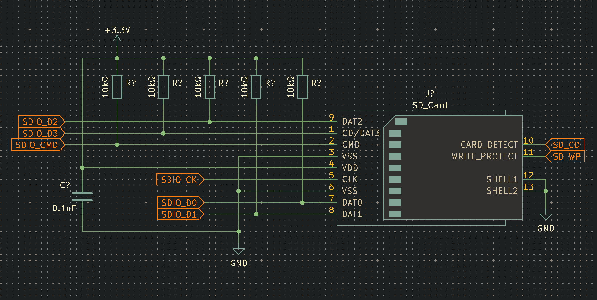
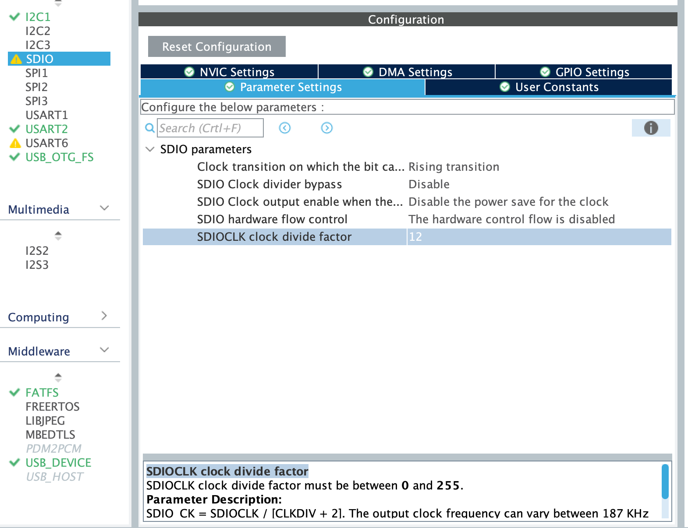

# STM32F401REx - SD Card and USB Communication Device Class (CDC)

This repository contains working example codes for SD Card management through SDIO protocol and for USB FS - Communication Device Class. I'm using a STM32F401RET6 MCU with a custom made developer board to test the code, but it should work with other STM32 variants as well. (of course they need to support SDIO and/or the USB device mode, for reference, please check the official datasheet)

## SD Card library

### Setting up the MCU

This library is made for the SDIO connection using the provided middlewares from ST (those are also included in this project) For a working exact wiring design, please follow the one I've made bellow. Important to note, that although it is working on a breadboard, I had to reduce the clock speed significantly, for high performance applications, highly recommended to design a custom PCB and to use as short as possible traces.



Using STM32Cube IDE first you need to enable the SDIO function, setting the mode to "SD 4 bits Wide bus", then in the Middleware section, enabling the FatFS by checking the SD Card checkbox. By default you don't need to change anything here, it should work if everything else is correctly set up. (Clock and circuit) It might ask you to set up an extra pin for card detection, you should wire that pin to the card detect pin on the sd card slot. Sidenote: for me this never worked, that pin is always floating, so I had to manually connect the STM pin to ground to start working. (it can be an issue in the slot itself, so it might work with an other piece, but I don't have a spare one to test)

### Library reference

You need 2 files from this repo: ```Core/Src/sd_card.c``` and ```Core/Inc/sd_card.h``` You need to include the header file in your main C code and you can start using it directly. The workflow is the following:

- Mounting SD card
- Reading the content of the SD card
- Opening files to write
- After you finished, closing the open file
- Unmounting the SD card

If you want debug output, you need to define the following flag in your main header file: ```#define SD_CARD_DEBUG``` and then you also need to implement the following method:

```C
void SDCard_debug(char *string) {
	// Do anything here with the log string, one example:
	// HAL_UART_Transmit(&huart2, (uint8_t *)string, strlen (string), HAL_MAX_DELAY);
}
```

To speed up the library, you need to remove the define statement, so the code won't do any extra processing steps.

### Methods

For quick reference, please check the sd_card.h header file, more detailed documentation is comming soon!

### Troubleshooting

You need an sd card formatted as Fat32. The best if you start with a freshly formatted one and then if it's working properly, you can try other cards as well.

In case of error (FR_DISK_ERR), you need to lower the clock speed in the initialisation part of your code by increasing the clock divider value. If you use the GUI tool, then you can find it under "Connectivity/SDIO/SDIOCLK clock divide factor". As the description says, the value is calculated by the following formula: SDIOCLK/(CLKDIV + 2) The maximum frequency is 24MHz




